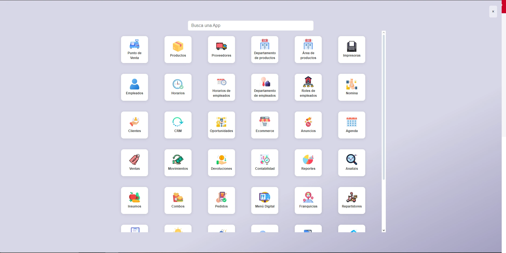
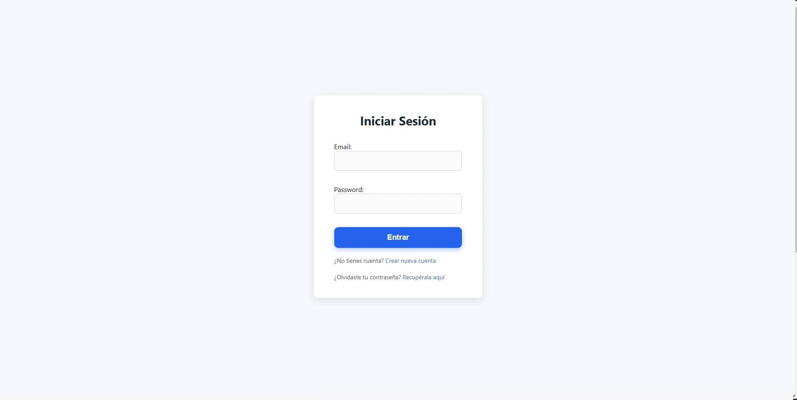
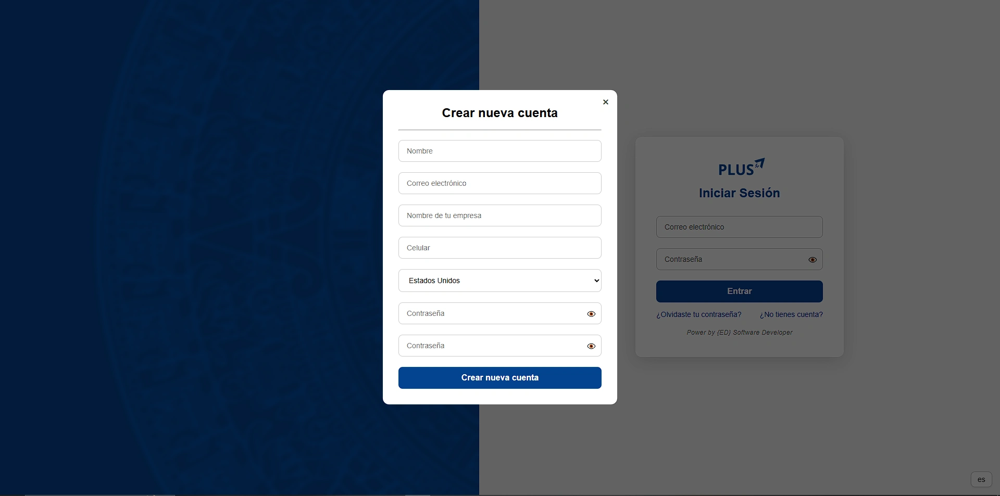
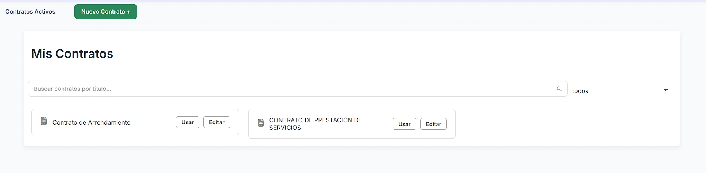

# PLUS ERP - Sistema Mexicano para Mexicanos 🇲🇽.


**PLUS** es un ERP moderno, minimalista y elegante, inspirado en soluciones como Odoo, pero adaptado a las necesidades reales en México y América Latina.

PLUS está diseñado para resolver los problemas cotidianos que enfrentan profesionostas en Mexico como dentistas, doctores, abogados, contadores, etc: gestión de clientes, organización de proyectos, manejo de documentos, facturación, agenda y reportes — todo en una interfaz clara, profesional y de uso sencillo.

**PLUS ERP** es un proyecto **de código abierto** porque creo firmemente en el poder de la comunidad, la colaboración y el aprendizaje compartido 🌎💻.


# PLUS ERP - REGLAS DE USO.
Nos basamos en un **modelo híbrido de código abierto y monetización opcional**:

---

## 💻 Núcleo abierto
El **core de PLUS ERP** es completamente libre bajo **AGPL-3.0**.  

- Puedes usarlo, estudiarlo, modificarlo y desplegarlo.  
- Mantén el núcleo abierto y accesible para todos.  
- Incluye las funcionalidades esenciales: ventas, inventario, facturación, reportes, archivos, y gestión de clientes.

---

## 🧩 Módulos personalizados
- Puedes crear **módulos adicionales**, gratuitos o pagos, para ampliar la funcionalidad del ERP.  
- Estos módulos pueden monetizarse sin afectar el núcleo.  
- Permite a la comunidad innovar y generar ingresos respetando el código base.

---

## 📜 Licencia y condiciones

**PLUS ERP** se distribuye bajo **AGPL-3.0**, asegurando que el código base siga abierto y accesible.  

**PLUS ERP** es gratuito para que cualquier empresa, programador o persona interesada pueda estudiarlo, modificarlo y usarlo. Lo único que pido a cambio es que se respeten estas pequeñas condiciones para que la comunidad crezca de forma sana y respetuosa:

1. **Atribución**  
   Si usas **PLUS ERP** o alguna parte de su código en tus proyectos, por favor incluye el crédito al creador original:  
   `Creado por Martínez Ortiz Eduardo Antonio (México)` 🙋🏻‍♂️

2. **Compartir mejoras**  
   Si haces modificaciones o mejoras interesantes, sería genial que las compartas de vuelta a la comunidad mediante Pull Requests o publicando tu fork. Así todos aprendemos y el proyecto sigue mejorando 🚀.

3. **No cierres el código**  
    No está permitido tomar este engine y convertirlo en un producto cerrado o privativo. La idea es que siga siendo abierto para siempre, accesible y transparente 🔓.

4. **Respeto en la comunidad**  
   Si se genera una comunidad en torno a **PLUS ERP** (foros, Discord, GitHub Issues), te pido que siempre participes con respeto, apertura y buen rollo 🤝.

---

### 👉 ¿Por qué hacerlo abierto?

Porque la magia del código abierto es la colaboración. Al compartir tu conocimiento y tu trabajo, ayudas a que otros mejoren el software, aprendan y creen soluciones increíbles que quizá ni imaginábamos.  

Espero que **PLUS ERP** inspire a otros desarrolladores mexicanos y latinoamericanos a crear más herramientas pensadas para nuestro contexto, idioma, empresas y necesidades 🎉. Siempre he pensado que nuestro proposito como programadores es crear Tecnología con un toque de magia ❤️


---
### Link para el manual del programador
https://eduardomartinez68.github.io/EduardoMartinez68/

---
## 👤 Sobre el autor

**Nombre:** Martínez Ortiz Eduardo Antonio  
**Nacionalidad:** Mexicano 🇲🇽  
**Perfil:** Desarrollador Full Stack apasionado por el software para negocios reales.

Inicié este proyecto porque quería usar Odoo para crear un software ERP para abogados en 🇲🇽 México. Pensé: “esto va a ser pan comido”. Spoiler: NO LO FUE. 😅
Había muchísimas incompatibilidades, no entendía el código que escribían otros programadores 👨🏻‍💻, y cada vez que surgía un error, tenía que restaurar archivos completos 🤯.

Pasé días — sí, días enteros — intentando cambiar el nombre del módulo "Proyectos" por "Casos" ⚖️... ¿el resultado? ¡Jamás lo logré! 😂

Así que me harté, respiré profundo, y decidí crear mi propio ENGINE ERP... with blackjack and hookers 🃏🍸 — bueno, en realidad, con código limpio y pensado para que cualquier negocio en México pudiera usarlo sin dolores de cabeza 🙌.


👉 Nota personal:

No tengo absolutamente nada en contra de Odoo — de hecho, ¡lo admiro mucho! 👏
Me parece una plataforma impresionante, bien diseñada y además hecha en mi lenguaje favorito: Python 🐍❤️.

Pero hay algo que siempre me pasa como programador: cuando uso una herramienta, siempre pienso... "yo podría hacer esto mejor (o al menos, más a mi manera)" 😅. No necesariamente "mejor" para todo el mundo, sino mejor para mí y para otros frikis como yo y que quieran ayudar a otros de esta manera.

Así nació este proyecto: no como un "competidor" de Odoo, sino como una alternativa más simple, más enfocada, hecha desde cero con mucho cariño por alguien que quería entender cada línea de su propio ERP. Ahora El plan es crear un ENGINE super facil, creado para que incluso programadores inexpertos puedan crear sus propias apps para empresas. Ahora en mi ENGINE es super facil cambiar el nombre de las apps ya que solo necesitas un solo clic jaja tambien queria que las dependencias fueran extremadamente facil de agregar y que fuera mas facil de personalizar para otras personas y que el codigo de las apps no sean tan extensas. 

El objetivo de PLUS es ser un **engine abierto** y extensible para que otros programadores, profesionales y estudios puedan adaptarlo a su realidad, aportar mejoras y evolucionarlo en comunidad.


---
#open-source #business

## ✨ Características principales (planes a futuro)
- Gestión de clientes
- Gestión de proyectos
- Control de facturación y pagos
- Agenda de eventos y tareas
- Reportes dinámicos
- Soporte multi-usuario y control de permisos
- UI moderna y elegante (inspirada en Odoo y otras apps líderes)


---
Tecnología con un toque de magia ❤️

## 🚀 Roadmap de funcionalidades (planes a futuro)

- ✅ Agenda avanzada con notificaciones
- ✅ Plantillas de documentos personalizables
- 🚧 Portal para clientes (self-service)
- 🚧 Firma electrónica integrada
- 🚧 Chat interno para abogados
- 🚧 Integración con calendario Google/Outlook

---


---

## 📦 Instalación técnica

### Requisitos

- Python  
- PostgreSQL  
- Git

### Instrucciones

```bash
git clone https://github.com/EduardoMartinez68/PLUS_ENGINE_ERP   
cd plus-erp
npm install



---
