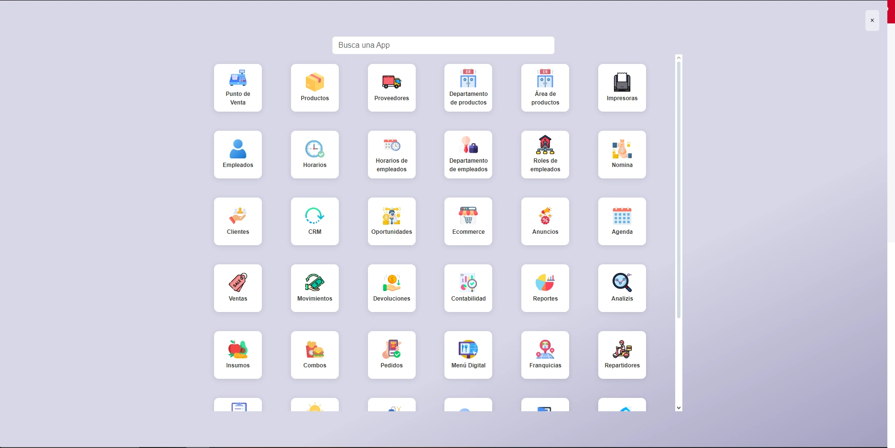
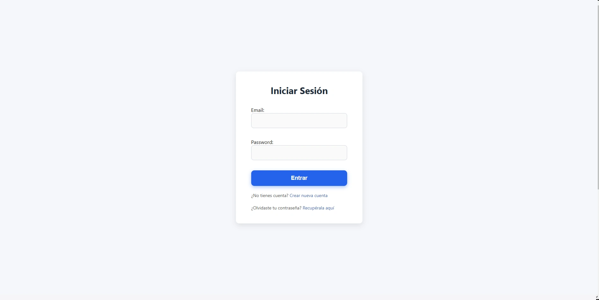
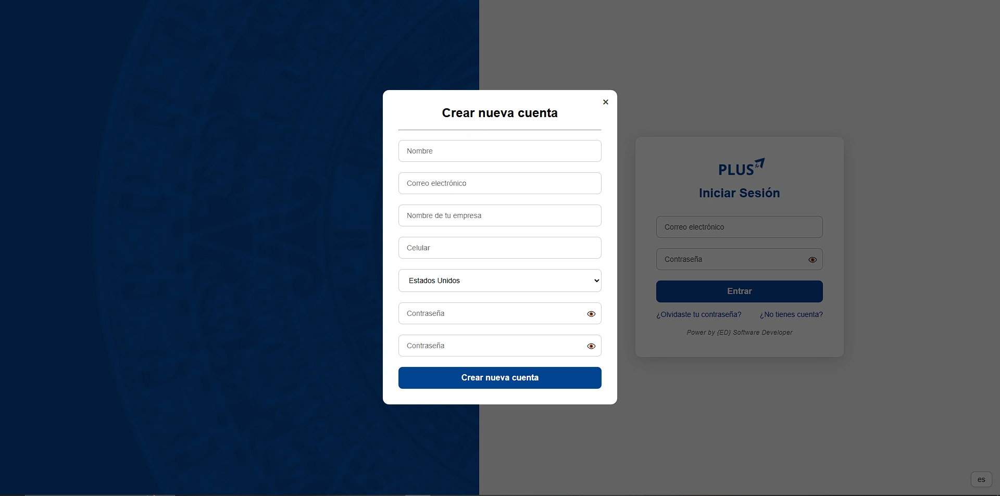
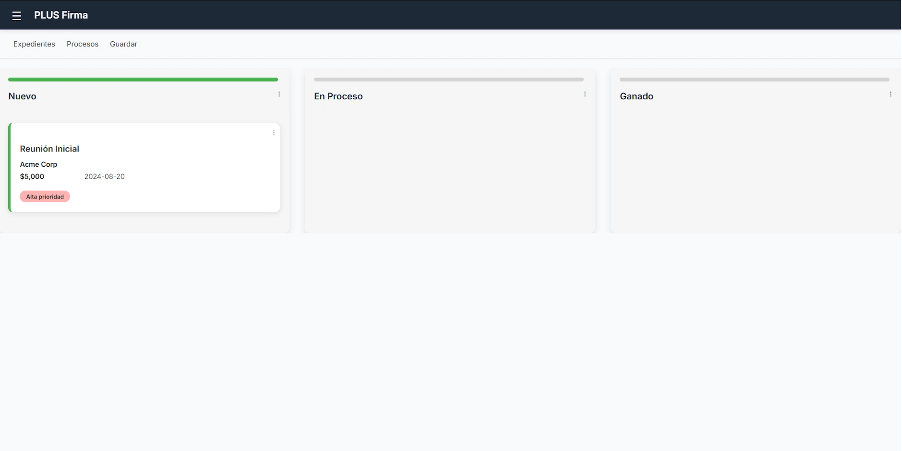

# PLUS ERP - Sistema Mexicano para Mexicanos 🇲🇽.


**PLUS** es un ERP moderno, minimalista y elegante, inspirado en soluciones como Odoo, pero adaptado a las necesidades reales en México y América Latina.

PLUS está diseñado para resolver los problemas cotidianos que enfrentan abogados y despachos legales: gestión de clientes, organización de casos, manejo de documentos, facturación, agenda y reportes — todo en una interfaz clara, profesional y de uso sencillo.

Tecnología con un toque de magia ❤️
---
## 👤 Sobre el autor

**Nombre:** Martínez Ortiz Eduardo Antonio  
**Nacionalidad:** Mexicano 🇲🇽  
**Perfil:** Desarrollador Full Stack apasionado por el software para negocios reales.

Inicié este proyecto porque quería usar Odoo para crear un software ERP para abogados en 🇲🇽 México. Pensé: “esto va a ser pan comido”. Spoiler: NO LO FUE. 😅
Había muchísimas incompatibilidades, no entendía el código que escribían otros programadores 👨🏻‍💻, y cada vez que surgía un error, tenía que restaurar archivos completos 🤯.

Pasé días — sí, días enteros — intentando cambiar el nombre del módulo "Proyectos" por "Casos" ⚖️... ¿el resultado? ¡Jamás lo logré! 😂

Así que me harté, respiré profundo, y decidí crear mi propio ENGINE ERP... with blackjack and hookers 🃏🍸 — bueno, en realidad, con código limpio y pensado para que cualquier negocio en México pudiera usarlo sin dolores de cabeza 🙌.


👉 Nota personal:

No tengo absolutamente nada en contra de Odoo — de hecho, ¡lo admiro mucho! 👏
Me parece una plataforma impresionante, bien diseñada y además hecha en mi lenguaje favorito: Python 🐍❤️.

Pero hay algo que siempre me pasa como programador: cuando uso una herramienta, siempre pienso... "yo podría hacer esto mejor (o al menos, más a mi manera)" 😅. No necesariamente "mejor" para todo el mundo, sino mejor para mí y para otros frikis como yo y que quieran ayudar a otros de esta manera.

Así nació este proyecto: no como un "competidor" de Odoo, sino como una alternativa más simple, más enfocada, hecha desde cero con mucho cariño por alguien que quería entender cada línea de su propio ERP. Ahora El plan es crear un ENGINE super facil, creado para que incluso programadores inexpertos puedan crear sus propias apps para empresas. Ahora en mi ENGINE es super facil cambiar el nombre de las apps ya que solo necesitas un solo clic jaja tambien queria que las dependencias fueran extremadamente facil de agregar y que fuera mas facil de personalizar para otras personas. 

El objetivo de PLUS es ser un **engine abierto** y extensible para que otros programadores, despachos y estudios jurídicos puedan adaptarlo a su realidad, aportar mejoras y evolucionarlo en comunidad.


---

## ✨ Características principales (planes a futuro)
- Gestión de clientes
- Gestión de casos jurídicos
- Plantillas de documentos legales
- Control de facturación y pagos
- Agenda de audiencias y tareas
- Reportes dinámicos
- Soporte multi-usuario y control de permisos
- UI moderna y elegante (inspirada en Odoo y otras apps líderes)

---

## 🚀 Roadmap de funcionalidades (planes a futuro)

- ✅ Agenda avanzada con notificaciones
- ✅ Plantillas de documentos personalizables
- 🚧 Portal para clientes (self-service)
- 🚧 Firma electrónica integrada
- 🚧 Chat interno para abogados
- 🚧 Integración con calendario Google/Outlook

---


## 📜 Condiciones de Uso y Filosofía de Código Abierto

**PLUS ERP** es un proyecto **de código abierto** porque creo firmemente en el poder de la comunidad, la colaboración y el aprendizaje compartido 🌎💻.

El software libre y abierto nos permite:

✅ Aprender unos de otros  
✅ Adaptar las herramientas a nuestras necesidades  
✅ Mejorar el software entre todos  
✅ Democratizar el acceso a tecnología de calidad  

**PLUS ERP** es gratuito para que cualquier empresa, programador o persona interesada pueda estudiarlo, modificarlo y usarlo. Lo único que pido a cambio es que se respeten estas pequeñas condiciones para que la comunidad crezca de forma sana y respetuosa:

1. **Atribución**  
   Si usas **PLUS ERP** o alguna parte de su código en tus proyectos, por favor incluye el crédito al creador original:  
   `Creado por Martínez Ortiz Eduardo Antonio (México)` 🙋🏻‍♂️

2. **Compartir mejoras**  
   Si haces modificaciones o mejoras interesantes, sería genial que las compartas de vuelta a la comunidad mediante Pull Requests o publicando tu fork. Así todos aprendemos y el proyecto sigue mejorando 🚀.

3. **No cierres el código**  
   No está permitido tomar este engine y convertirlo en un producto cerrado o privativo. La idea es que siga siendo abierto para siempre, accesible y transparente 🔓.

4. **Respeto en la comunidad**  
   Si se genera una comunidad en torno a **PLUS ERP** (foros, Discord, GitHub Issues), te pido que siempre participes con respeto, apertura y buen rollo 🤝.

---

### 👉 ¿Por qué hacerlo abierto?

Porque la magia del código abierto es la colaboración. Al compartir tu conocimiento y tu trabajo, ayudas a que otros mejoren el software, aprendan y creen soluciones increíbles que quizá ni imaginábamos.  

Espero que **PLUS ERP** inspire a otros desarrolladores mexicanos y latinoamericanos a crear más herramientas pensadas para nuestro contexto, idioma, empresas y necesidades 🎉. Siempre he pensado que nuestro proposito como programadores es crear Tecnología con un toque de magia ❤️


---

## 📦 Instalación técnica

### Requisitos

- Python  
- PostgreSQL  
- Git

### Instrucciones

```bash
git clone https://github.com/EduardoMartinez68/PLUS_ENGINE_ERP   
cd plus-erp
npm install

## 👨‍💻 Apartado técnico para desarrolladores

PLUS ERP es un sistema modular, basado en python :

- **Frontend:** HTML + CSS (sin Bootstrap)
- **Backend:** PYTHON
- **Base de datos:** PostgreSQL
- **Arquitectura:** MVC ligera
- **Estilo:** CSS propio con prefijos `sub-menu-app-` para evitar colisiones
```

---
---
---
# Manual de funciones
## ⚠️ show_alert()

Función JavaScript para mostrar ventanas emergentes (popups) de alerta en la interfaz.  
Permite mostrar diferentes tipos de mensajes al usuario: **información, éxito, error, pregunta**, etc.

`show_alert()` actualiza dinámicamente una ventana de alerta personalizada en el HTML, cambiando su texto, íconos, colores y botones, según el tipo de mensaje que deseamos mostrar.

### ⚙️ Parámetros

```js
show_alert(
    type,           // (string) Tipo de alerta: 'info', 'success', 'alert', 'question'
    title,          // (string) Título que se mostrará en la alerta
    description,    // (string) Texto descriptivo del mensaje
    readmoreText    // (string, opcional) Texto adicional para mostrar más detalles (por ejemplo: errores técnicos)
)
```
---
## 🔔 show_notification()

Función JavaScript para mostrar notificaciones flotantes de tipo *toast*.  
Ideal para informar rápidamente al usuario sobre el resultado de una acción: éxito, error, advertencia, etc.

`show_notification()` crea dinámicamente una pequeña tarjeta de notificación que aparece en la interfaz durante unos segundos, con iconos y estilos personalizados según el tipo de mensaje.


### ⚙️ Parámetros

```js
show_notification(
    type = 'info',    // (string) Tipo de notificación: 'success', 'error', 'warning', 'info'
    message = '',     // (string) Texto a mostrar en la notificación
    duration = 4000   // (int) Tiempo en milisegundos que se mostrará (default: 4000 ms)
)
```
---
## 🔍 update_table_with_seeker()
### 👉 ¿Cómo actualizar tablas con la ayuda de un motor de búsqueda?

Función JavaScript para actualizar una tabla HTML en tiempo real a medida que el usuario escribe en un campo de búsqueda (input), obteniendo datos dinámicos desde el servidor.


`update_table_with_seeker` permite mejorar la experiencia de usuario permitiendo búsquedas en tiempo real sobre una tabla, sin necesidad de recargar la página.

Ideal para integraciones tipo CRM, sistemas administrativos, buscadores de clientes, productos, empleados, etc.

### ⚙️ Parámetros

```js
update_table_with_seeker(
    inputId,      // (string) ID del campo de búsqueda (input)
    tableId,      // (string) ID de la tabla HTML que se actualizará
    columns,      // (array) Lista de columnas a mostrar, en el mismo orden que la tabla
    searchUrl,    // (string) URL de la API o endpoint que devolverá los resultados
    delay = 500   // (opcional, int) Tiempo de espera en ms antes de enviar la búsqueda (default: 500)
)
```
---

